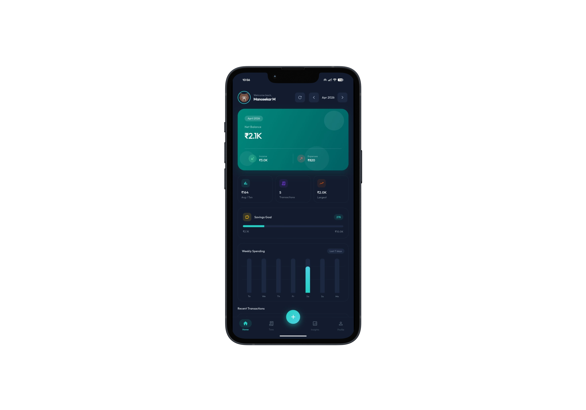
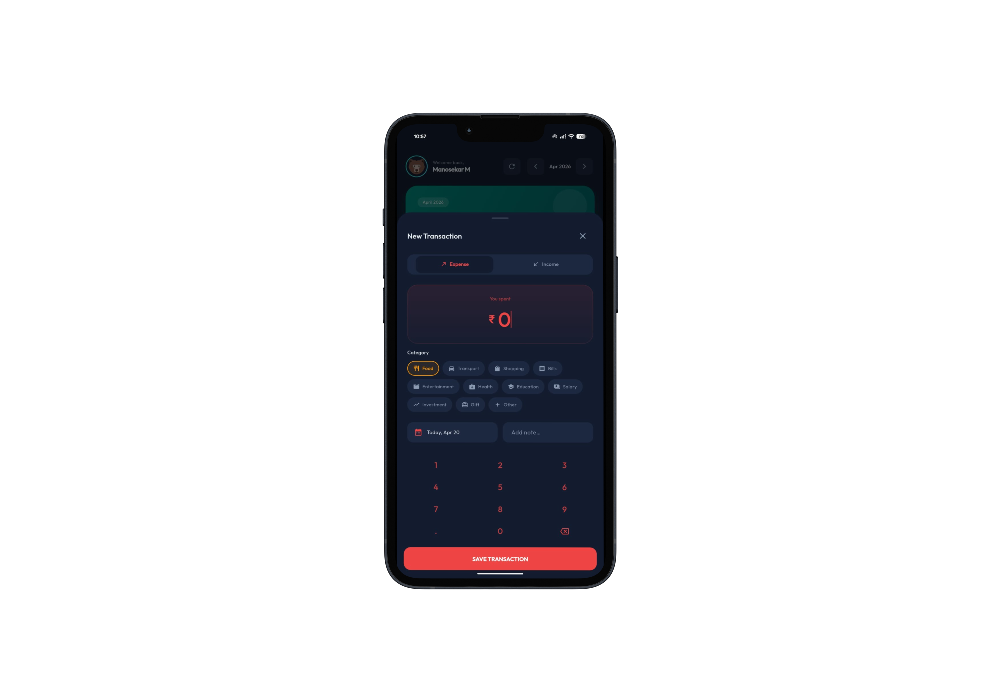
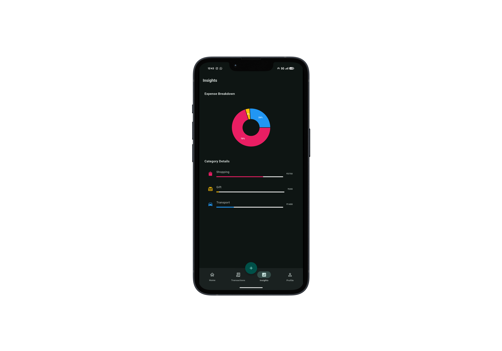
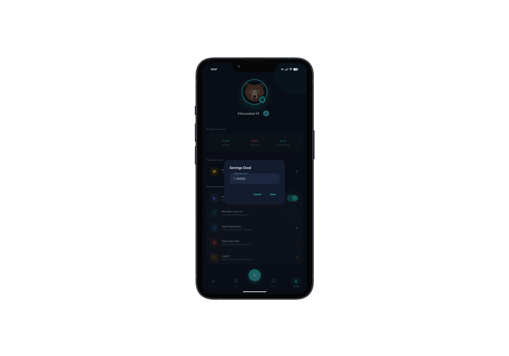

# 💰 Fin Tracker — Modern Personal Finance Companion

<p align="center">
  
  
  
  
</p>

---

## 🚀 Overview

**Fin Tracker** is a premium, high-performance personal finance management application built with **Flutter**. It empowers users to take control of their financial life with real-time expense tracking, insightful analytics, and goal-oriented saving strategies—all wrapped in a stunning, modern UI.

Designed with a focus on **User Experience (UX)** and **Clean Architecture**, this project demonstrates industry-level development practices, including state management, persistent local storage, and secure biometric authentication.

---

## ✨ Key Features

### 📊 Dynamic Insights & Analytics
- **Visualized Data**: Interactive charts powered by `fl_chart` to track income vs. expenses.
- **Category Breakdown**: High-level overview of where your money goes.
- **Trend Analysis**: Monitor weekly and monthly financial progress.

### 🎯 Goal Tracking System
- **Milestone Management**: Set monthly saving targets and visualize progress.
- **Real-time Updates**: Instant feedback as you log transactions.
- **Percentage Tracking**: Clear visibility into how close you are to your goals.

### 🔒 Enterprise-Grade Security
- **Biometric Lock**: Privacy protected by Fingerprint/FaceID using `local_auth`.
- **Local Sovereignty**: All data stays on your device using Hive's encrypted storage options.

### 🎨 Premium UI/UX
- **Glassmorphism**: Modern aesthetic with subtle gradients and blur effects.
- **Animations**: Smooth transitions and micro-animations for an "alive" feel.
- **Responsiveness**: Pixel-perfect layout across Android, iOS, and Web.

---

## 📸 Visual Walkthrough

<table border="0">
  <tr>
    <td width="50%">
      <p align="center"><b>Dashboard</b></p>
      
    </td>
    <td width="50%">
      <p align="center"><b>Transactions</b></p>
      
    </td>
  </tr>
  <tr>
    <td width="50%">
      <p align="center"><b>Financial Insights</b></p>
      
    </td>
    <td width="50%">
      <p align="center"><b>Savings Goals</b></p>
      
    </td>
  </tr>
</table>

---

## 🧠 Technical Excellence

### Core Stack
- **Framework**: [Flutter](https://flutter.dev/) (Multi-platform)
- **State Management**: [Provider](https://pub.dev/packages/provider) (Clean, scalable, and reactive)
- **Database**: [Hive](https://pub.dev/packages/hive) (Ultra-fast, NoSQL local database)
- **Visualization**: [fl_chart](https://pub.dev/packages/fl_chart)
- **Auth**: [local_auth](https://pub.dev/packages/local_auth) (Biometrics)

### Architecture
The project follows a **Modified MVC/MVVM** approach to ensure:
- **Separation of Concerns**: UI, logic, and data layers are strictly decoupled.
- **Scalability**: New features can be added with minimal impact on existing code.
- **Performance**: Optimized rendering and efficient data fetching.

---

## ⚙️ Quick Start

### Prerequisites
- Flutter SDK (>= 3.0.0)
- Android Studio / VS Code

### Installation
1. **Clone the repository**
   ```bash
   git clone https://github.com/manosekar-m/Fin-Tracker.git
   cd Fin-Tracker
   ```

2. **Install dependencies**
   ```bash
   flutter pub get
   ```

3. **Run the app**
   ```bash
   flutter run
   ```

---

## 👨‍💻 Author

**Mano Sekar**
*Full Stack Developer | UI/UX Enthusiast*

[](https://www.linkedin.com/in/manosekar-m/)
[](https://github.com/manosekar-m)

---

> Built with ❤️ and precision using Flutter. If you find this project useful, don't forget to ⭐ it!
